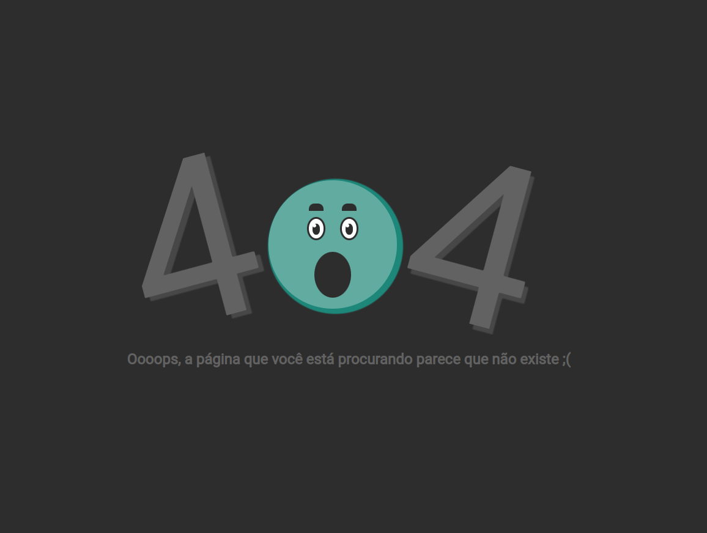
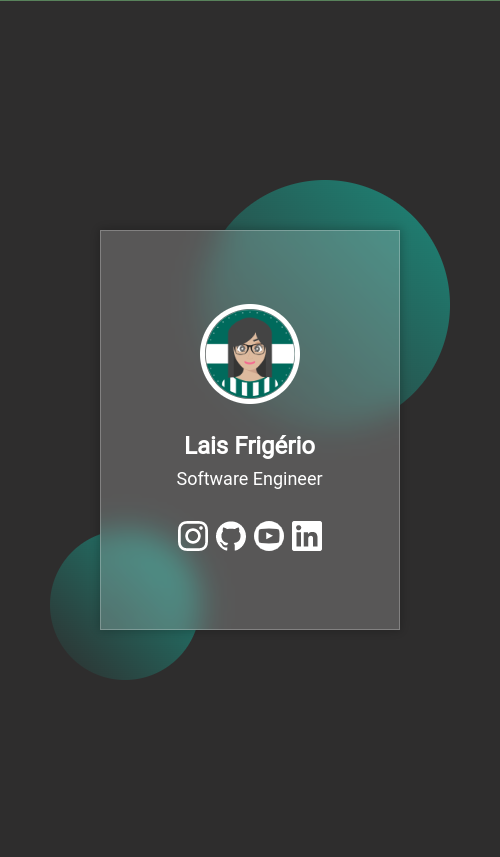
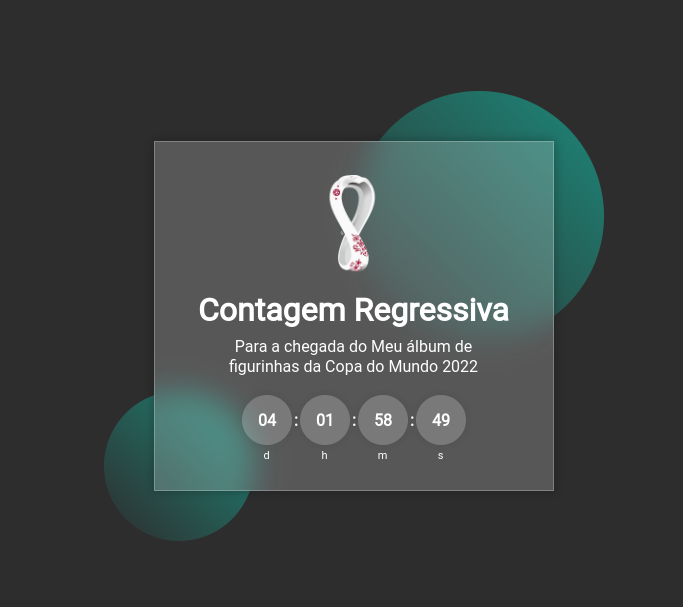
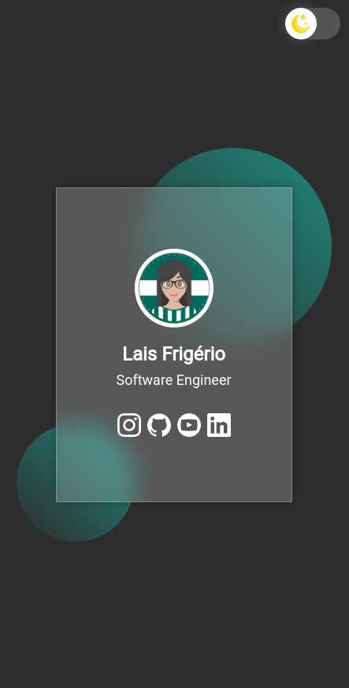

# 21 dias de código com a Rocketseat 🚀

- [x] Dia 01: Criando o repositório
- [x] Dia 02: Famoso "Hello World" com HTML e CSS
- [x] Dia 03: Botão Animado - Efeito Pulso
- [x] Dia 04: Calculadora
- [x] Dia 05: Página de erro 404
- [x] Dia 06: Efeito Glassmorphism
- [x] Dia 07: Contador regressivo em Javascript
- [x] Dia 08: Toggle que altera o tema de uma página entre Light e Dark mode
- [x] Dia 09: Loading
- [ ] Dia 10: ...

## Dia 02: "Hello World" com efeito de digitação

  

## Dia 03: Botão Animado

Inspirada no efeito de pulso da logo do Skype, eu criei uma versão utilizando apenas HTML + CSS

  

## Dia 04: Calculadora

  

## Dia 05: Página de erro 404

  

## Dia 06: Efeito Glassmorphism

  

## Dia 07: Contador regressivo em Javascript

  

## Dia 08: Toggle que altera o tema de uma página entre Light e Dark mode

  

  

## Dia 09: Loading

  

