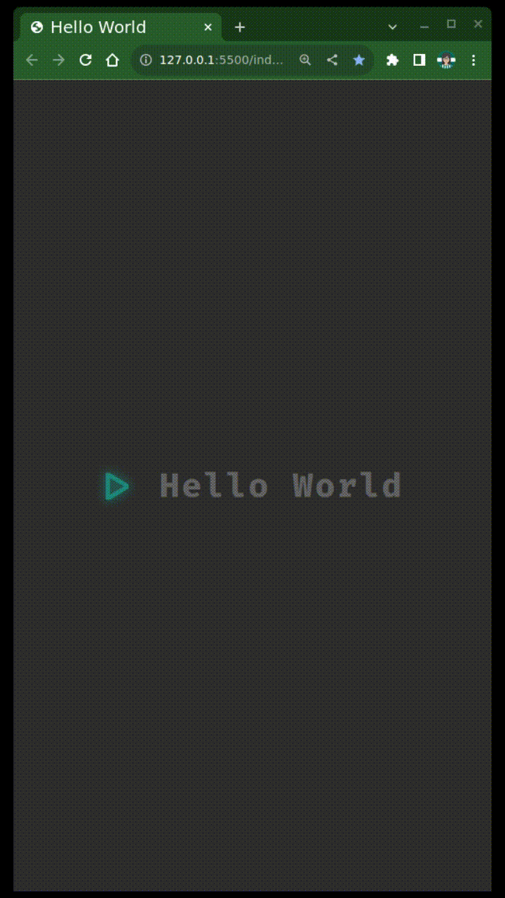
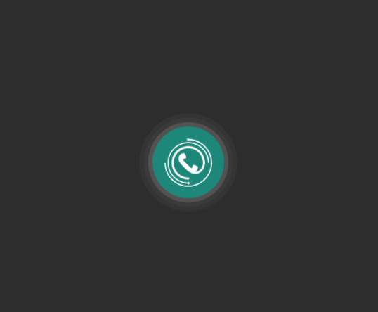
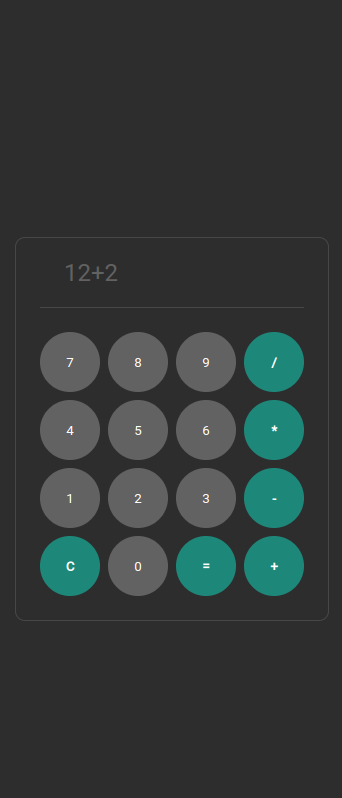

# 21 dias de código com a Rocketseat 🚀

- [x] Dia 01: Criando o repositório
- [x] Dia 02: Famoso "Hello World" com HTML e CSS
- [x] Dia 03: Botão Animado - Efeito Pulso
- [x] Dia 04: Calculadora
- [x] Dia 05: Página de erro 404
- [ ] Dia 06: ...

## Dia 02: "Hello World" com efeito de digitação

  

## Dia 03: Botão Animado

Inspirada no efeito de pulso da logo do Skype, eu criei uma versão utilizando apenas HTML + CSS

  

## Dia 04: Calculadora

  

## Dia 05: Página de erro 404

  

