# 21 dias de código com a Rocketseat 🚀

- [x] Dia 01: Criando o repositório
- [x] Dia 02: Famoso "Hello World" com HTML e CSS
- [x] Dia 03: Botão Animado - Efeito Pulso
- [x] Dia 04: Calculadora
- [x] Dia 05: Página de erro 404
- [x] Dia 06: Efeito Glassmorphism
- [x] Dia 07: Contador regressivo em Javascript
- [x] Dia 08: Toggle que altera o tema de uma página entre Light e Dark mode
- [x] Dia 09: Loading
- [x] Dia 10: Uso da biblioteca Particle.js
- [x] Dia 11: Tela de Login
- [x] Dia 12: Galeria
- [x] Dia 13: Menu responsivo
- [x] Dia 14: Quiz Copa do Mundo
- [x] Dia 15: E-commerce
- [x] Dia 16: Consumindo uma API pública
- [x] Dia 17: Captirando eventos do teclado
- [x] Dia 18: Gerador de senha
- [x] Dia 19: Listando imagens de uma API pública | Random Dog Image
- [ ] Dia 20: ...

## Dia 02: "Hello World" com efeito de digitação

  

## Dia 03: Botão Animado

Inspirada no efeito de pulso da logo do Skype, eu criei uma versão utilizando apenas HTML + CSS

  <a>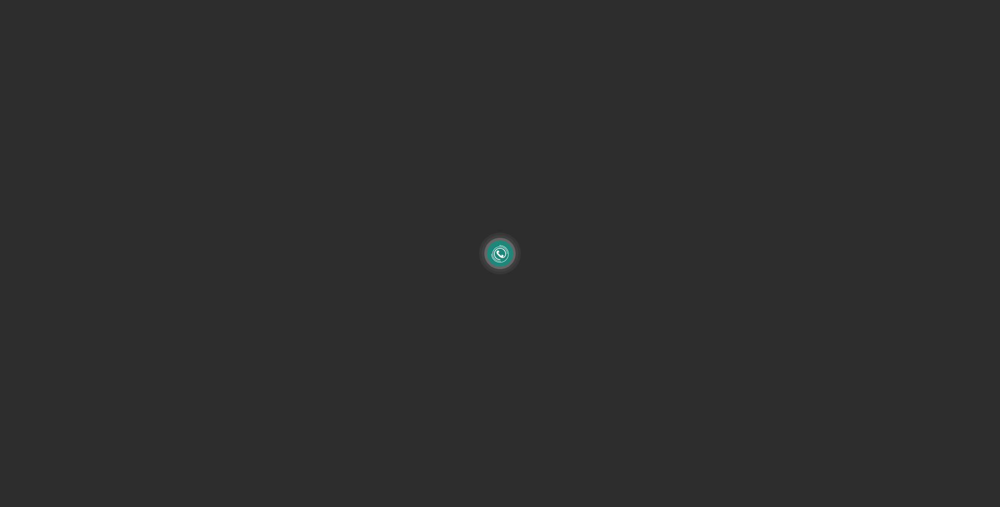</a>

## Dia 04: Calculadora

  

## Dia 05: Página de erro 404

  

## Dia 06: Efeito Glassmorphism

  

## Dia 07: Contador regressivo em Javascript

  

## Dia 08: Toggle que altera o tema de uma página entre Light e Dark mode

  

  

## Dia 09: Loading

  

  

## Dia 10: Uso da biblioteca Particle.js

  

  

## Dia 11: Tela de Login

  

  

## Dia 12: Galaeria de imagens

  

## Dia 13: Menu responsivo

  <a>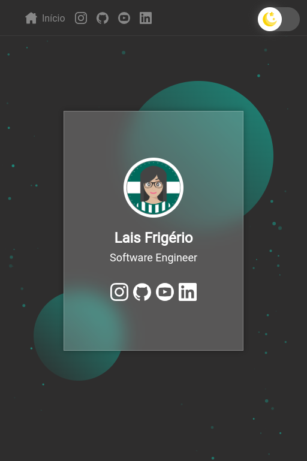</a>

  <a>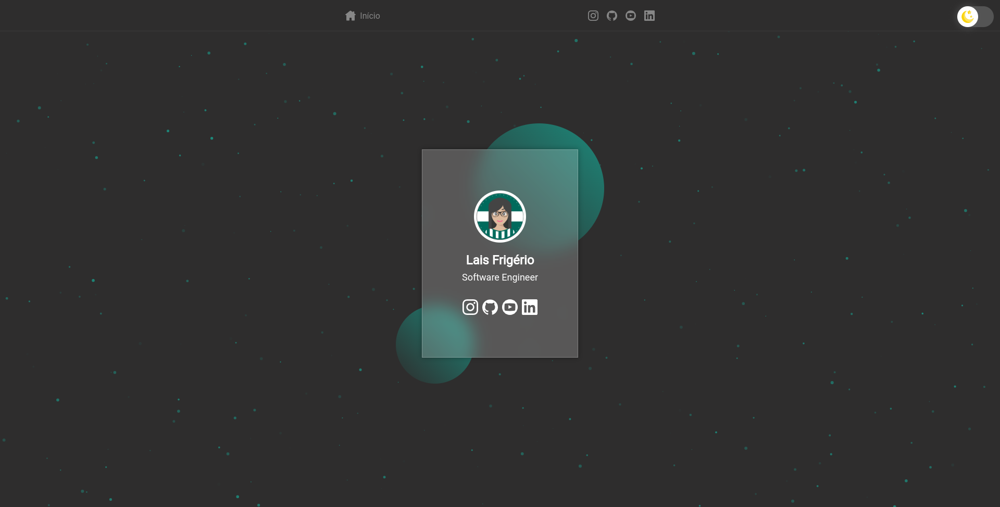</a>

## Dia 14: Quiz Copa do Mundo

  <a>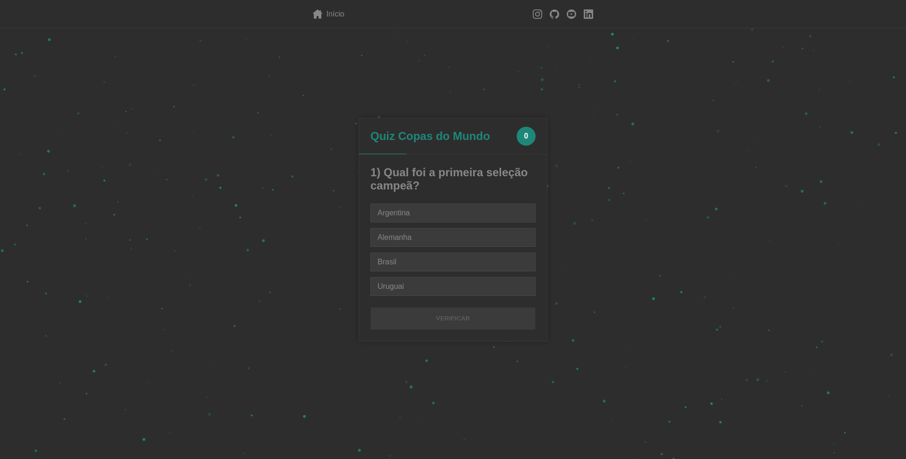</a>

  <a>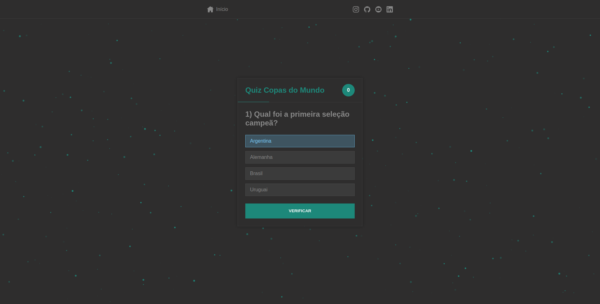</a>

  <a>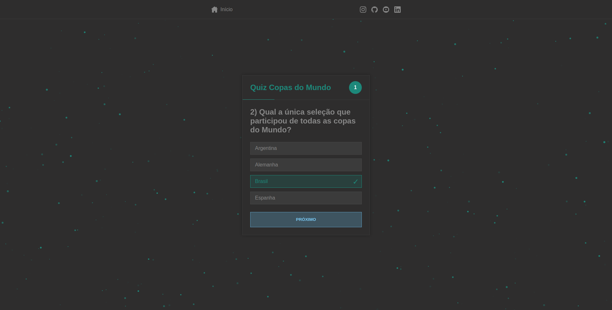</a>

  <a>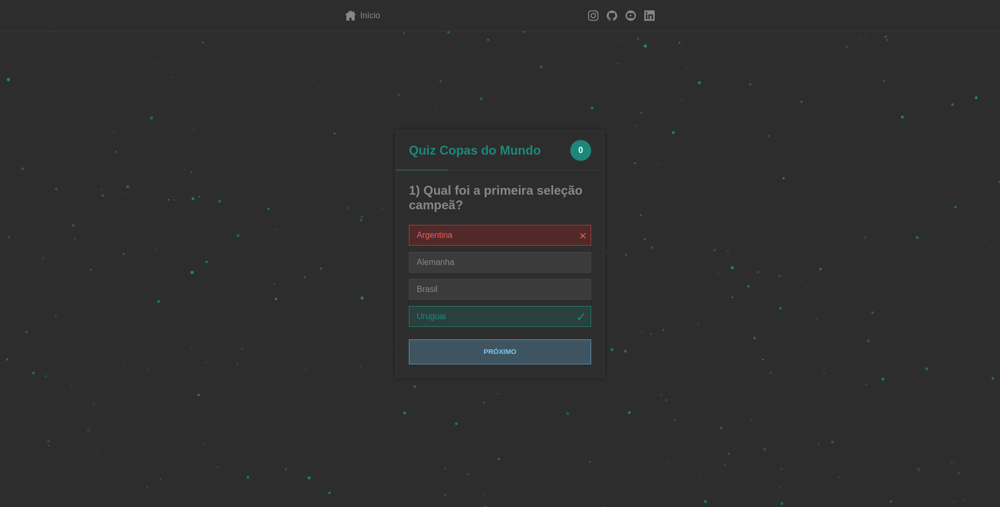</a>

## Dia 15: E-commerce

  <a>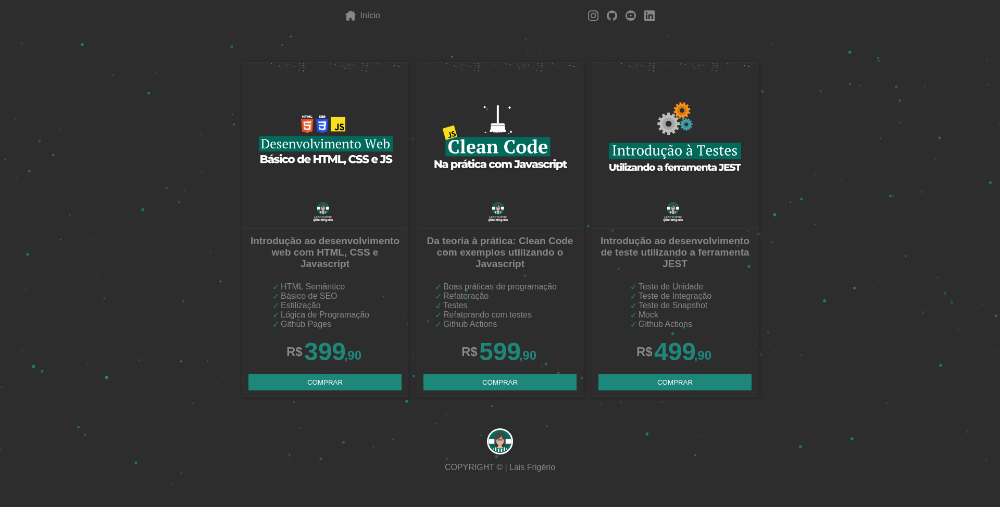</a>

## Dia 16: Consumindo uma API Pública (Trivia Quiz)

  <a>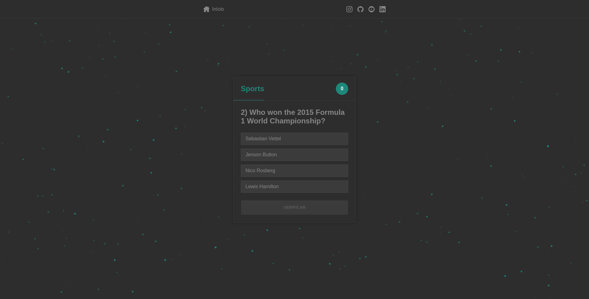</a>

## Dia 17: Capturando eventos do teclado

  <a>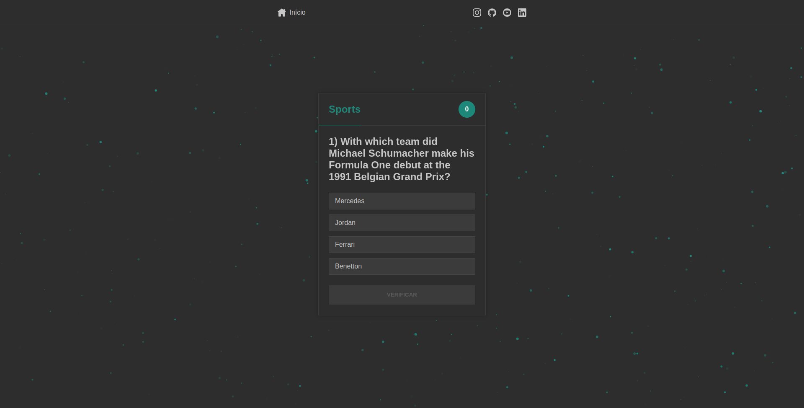</a>

## Dia 18: Gerador de senha

  <a>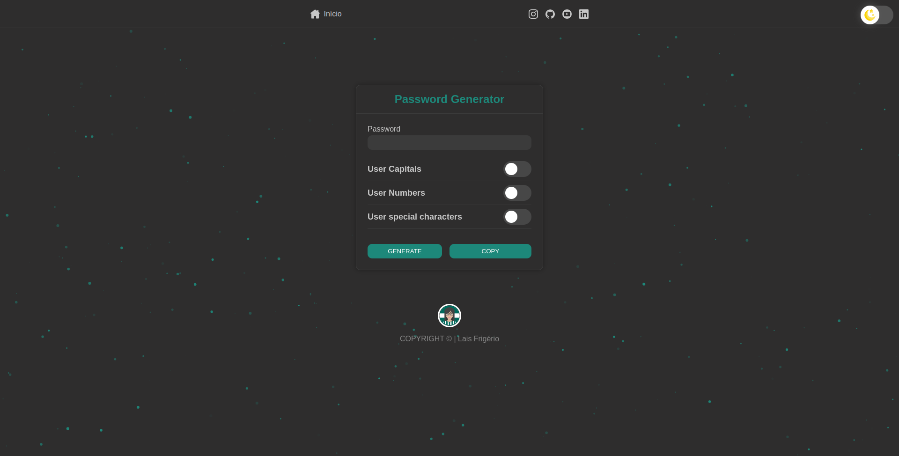</a>

